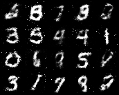

<div align="center">

# Pantheon Lab Programming Assignment

<a href="https://pytorch.org/get-started/locally/"></a>
<a href="https://pytorchlightning.ai/"></a>
<a href="https://hydra.cc/"></a>
<a href="https://github.com/ashleve/lightning-hydra-template"></a><br>

</div>

## What is all this?
This repository features a GAN for MNIST digit generation and a Stable Diffusion model for creating flower images from text descriptions. It includes training routines for both networks, showcasing deep learning approaches to generative modeling in response to a "programming assignment."


## Questions and Answers?
1. What is the role of the discriminator in a GAN model? Use this project's discriminator as an example.
In a GAN (Generative Adversarial Network) model, the role of the discriminator is to distinguish between real and fake data. The discriminator is trained to maximize its ability to correctly label real data as real and generated (fake) data as fake. In this specific project, the discriminator takes flattened images as input and outputs a single scalar representing the probability that the given image is real. The model uses a series of linear layers and leaky ReLU activations to process the input, concluding with a sigmoid function to squish the output between 0 and 1, where 1 indicates 'real' and 0 'fake'.

2. The generator network in this code base takes two arguments: noise and labels. What are these inputs and how could they be used at inference time to generate an image of the number 5?
The generator in a GAN takes noise vectors as input, which provide a source of randomness that allows the generator to produce a variety of outputs. The optional labels argument could be used in a conditional GAN setup, where the labels help guide the generation process to produce outputs specific to the given labels. To generate an image of the number 5 at inference time, you would feed the generator a noise vector along with the label for '5', assuming the generator has been trained in a conditional manner to recognize and generate images corresponding to specific labels.

3. What steps are needed to deploy a model into production?
To deploy a model into production, several steps are typically involved:

Model Validation: Ensure the model meets performance criteria on a validation set.
Model Serialization: Save the trained model using a format like ONNX or TorchScript.
Deployment Environment: Set up the environment where the model will run, which could be a cloud platform, on-premises servers, or edge devices.
Integration: Integrate the model with the existing production infrastructure, which may involve API development for model inference.
Monitoring and Maintenance: Monitor the model's performance over time and update it as necessary to handle new data or performance issues.

4.If you wanted to train with multiple GPUs, what can you do in pytorch lightning to make sure data is allocated to the correct GPU?

To train with multiple GPUs in PyTorch Lightning efficiently, you can utilize the built-in Trainer class which simplifies setting up GPU configurations:

1. Setting Up the Trainer
You can specify the number of GPUs and the distribution strategy directly in the Trainer:

python
Copy code
from pytorch_lightning import Trainer
trainer = Trainer(gpus=2, accelerator='gpu', strategy='ddp')

2. Selecting a Strategy
DDP (Distributed Data Parallel) is recommended as it creates a complete model replica on each GPU, ensuring efficient parallel training.

3. Adjusting Batch Size
The total batch size specified is divided among the GPUs, so each GPU processes total_batch_size / num_gpus.

4. Environment Configuration
Ensure CUDA, cuDNN, and NCCL (on Linux) are properly installed to support multi-GPU training.

trainer = Trainer(gpus=2, accelerator='gpu', strategy='ddp')
model = YourLightningModule()
trainer.fit(model)
This setup maximizes training efficiency by ensuring each GPU is effectively utilized and data is correctly distributed.


**All implementation tasks in the code are marked with** `completed`


For example, training the model for around 20 epochs will give you results like this:



Specific training information (including training loss, valloss...) can be obtained from wandb

## Getting started
After cloning this repo, install dependencies
```yaml
# [OPTIONAL] create conda environment
conda create --name pantheon-py38 python=3.8
conda activate pantheon-py38

# install requirements
pip install -r requirements.txt
```

Train model with experiment configuration
```yaml
# default
python run.py experiment=train_mnist_gan.yaml

# train on CPU
python run.py experiment=train_mnist_gan.yaml trainer.gpus=0

# train on GPU
python run.py experiment=train_mnist_gan.yaml trainer.gpus=1
```

You can override any parameter from command line like this
```yaml
python run.py experiment=train_mnist_gan.yaml trainer.max_epochs=20 datamodule.batch_size=32
```

The current state of the code will fail at
`src/models/mnist_gan_model.py, line 29, in configure_optimizers`
This is because the generator and discriminator are currently assigned `null`
in `model/mnist_gan_model.yaml`. This is your first task in the "What you need to do" 
section.

## Open-Ended tasks (Bonus for junior candidates, expected for senior candidates)

Staying within the given Hydra - Pytorch-lightning - Wandb framework, show off your skills and creativity by extending the existing model, or even setting up a new one with completely different training goals/strategy. Here are a few potential ideas:

- **Implement your own networks**: you are free to choose what you deem most appropriate, but we recommend using CNN and their variants if you are keeping the image-based GANs as the model to train
- **Use a more complex dataset**: ideally introducing color, and higher resolution
- **Introduce new losses, or different training regimens**
- **Add more plugins/dependecy**: on top of the provided framework
- **Train a completely different model**: this may be especially relevant to you if your existing expertise is not centered in image-based GANs. You may want to re-create a toy sample related to your past research. Do remember to still use the provided framework.

## Questions

Try to prepare some short answers to the following questions below for discussion in the interview.

* What is the role of the discriminator in a GAN model? Use this project's discriminator as an example.

* The generator network in this code base takes two arguments: `noise` and `labels`.
What are these inputs and how could they be used at inference time to generate an image of the number 5?

* What steps are needed to deploy a model into production?

* If you wanted to train with multiple GPUs, 
what can you do in pytorch lightning to make sure data is allocated to the correct GPU? 

## Submission

- Using git, keep the existing git history and add your code contribution on top of it. Follow git best practices as you see fit. We appreciate readability in the commits
- Add a section at the top of this README, containing your answers to the questions, as well as the output `wandb` graphs and images resulting from your training run. You are also invited to talk about difficulties you encountered and how you overcame them
- Link to your git repository in your email reply and share it with us/make it public

<br>
